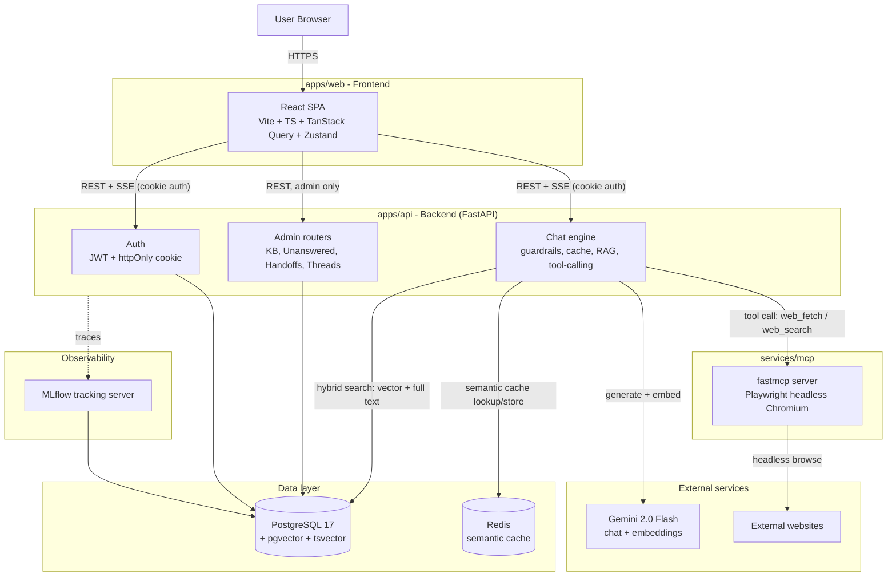
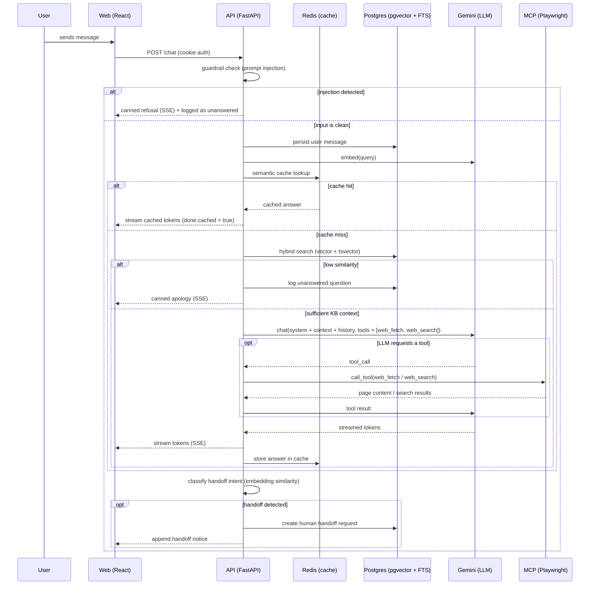
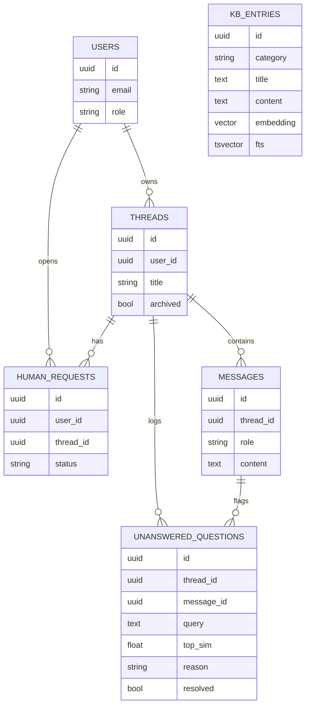

# AI Support Agent for Mission

A web application with an LLM-powered support agent for Mission, with an admin dashboard for managing the knowledge base.

> **This is the `main-databricks` branch.** LLM inference is served by a
> Databricks Model Serving endpoint (ResponsesAgent) with OAuth M2M auth,
> while RAG/cache/DB stay self-hosted — side-by-side with the handcrafted
> approach on `main`. See [docs/databricks-approach.md](docs/databricks-approach.md).

## Stack

| Layer | Technology |
|---|---|
| Backend | Python 3.14, FastAPI, SQLAlchemy 2 (async), asyncpg, Alembic |
| Database | PostgreSQL 17 + pgvector (RAG) |
| Frontend | React 19, Vite, TypeScript, TanStack Query, Zustand, Tailwind v4 |
| Auth | httpOnly cookies + JWT (HS256) |
| LLM | Gemini via Databricks ResponsesAgent serving endpoint (`LLM_PROVIDER=databricks`), or direct Gemini API (`LLM_PROVIDER=gemini`) |
| MCP | fastmcp server + Playwright (headless Chromium) for `web_fetch` |
| Observability | Self-hosted MLflow **and** Databricks managed MLflow (side-by-side) |
| Analytics | Unity Catalog Delta sync (`services/analytics/sync_to_uc.py`) |
| Container | Docker Compose (services: db, api, mcp, web) |
| Tooling | uv (Python), bun (JS), ruff, eslint, prettier |

## Architecture

### System overview



### Chat request flow



### Data model



`KB_ENTRIES` isn't tied to a user or thread. It's the shared knowledge base that every chat request searches through hybrid vector and full-text retrieval.

### Architecture summary

The system is split into four independently deployable pieces, wired together over Docker Compose:

- **`apps/web`** is a React SPA. It never sees an API token: it authenticates purely through an httpOnly cookie set by the backend, and talks to `apps/api` over REST for CRUD and over SSE for streamed chat replies.
- **`apps/api`** is the core FastAPI service. It owns auth (JWT in an httpOnly cookie), the chat pipeline (guardrails, then semantic cache, then hybrid RAG retrieval, then the LLM call with tool-calling, then handoff classification), and the admin CRUD routers (KB, unanswered questions, handoffs, threads), all backed by the same Postgres database.
- **`services/mcp`** is a separate fastmcp server that owns a headless Playwright browser. The API never touches a browser directly; it calls the MCP server as a tool over the MCP protocol, which keeps the heavier, less trusted web-fetching surface isolated from the main API process.
- **Postgres + pgvector** is the single source of truth for everything relational and for vector search. One database, no separate vector store, which keeps joins between KB entries, similarity scores, and admin queries simple. **Redis** sits alongside it purely as a semantic response cache, not as source-of-truth data.
- **MLflow** traces every meaningful step of a chat turn (embedding calls, tool calls, KB seeding) against the same Postgres backend, giving a request-level view of what the agent did without adding a new datastore.

Each service boundary here is intentional: the browser automation is isolated for security and stability, the LLM provider is abstracted behind `providers.py` so it can be swapped out, and the cache is a side-car rather than baked into the main request path, so a cache failure doesn't break chat.

## Repo structure

```
ai-support-agent/
├── apps/
│   ├── api/                # FastAPI backend
│   └── web/                # React SPA
├── services/
│   └── mcp/                # fastmcp server (web_fetch)
├── infra/                  # Dockerfiles + docker-compose.yml
├── specs/                  # (gitignored) planning docs
└── .env.example            # all env vars
```

## How to run locally

### Prereqs

- Docker + Docker Compose
- A Gemini API key

### Steps

1. `cp .env.example .env` and fill in:
   - `GEMINI_API_KEY`: your Gemini key
   - `JWT_SECRET`: any random 32+ byte string
   - `ADMIN_EMAIL`: the email that gets admin role on first login

2. `docker compose -f infra/docker-compose.yml up --build`

3. Wait for the healthchecks to pass (about 30s). Services:
   - Web: http://localhost:5173
   - API: http://localhost:8000
   - MLflow UI: http://localhost:5000
   - MCP: internal (not exposed to host)

4. Open http://localhost:5173. Enter any email. The admin email becomes an admin role automatically.

## Knowledge base strategy

The KB lives in a single Postgres table, `kb_entries`, with one row per piece of knowledge (`category`, `title`, `content`). Each row is indexed two ways so retrieval doesn't depend on the user phrasing their question exactly the way the KB was written:

- **Semantic (vector) search**: `content` is embedded with the Gemini embedding model and stored in a `pgvector` column, indexed with HNSW (`vector_cosine_ops`). This is what lets the agent match a question like "quanto custa?" against an entry titled "Planos e preços" even when there's no shared keyword.
- **Lexical (full-text) search**: the same text is also indexed as a Portuguese `tsvector` (GIN index), so exact terms, product names, and acronyms still get matched even when the embedding similarity is borderline.

At query time, both scores are computed in one SQL query and combined with a configurable weight (`vector_weight`, defaulting to 0.85 toward semantic). This hybrid-search approach ends up more robust than either signal on its own. The top result's combined score is then compared against `rag_unanswered_threshold`; if it falls short, the agent doesn't attempt an answer and logs the question instead, rather than risking a hallucinated response.

New entries created in the admin dashboard get embedded and indexed asynchronously (`BackgroundTasks` → `reembed_entry`), so the create/update request returns right away and the entry becomes searchable in the very next chat turn. There's no batch reindex step to wait on.

**Unanswered question logging**: whenever retrieval confidence is too low, or the LLM replies with a `[[NO_INFO]]` sentinel after also failing to find the answer via MCP web search, the question gets written to `unanswered_questions` along with the similarity score and a reason (`no_context` vs `injection`), so admins can see exactly what the KB is missing.

## MCP integration

Web access is implemented as a standalone **MCP server** (`services/mcp`) rather than as inline scraping code in the API. It exposes two tools, `web_fetch` (fetch a specific URL) and `web_search` (query the web), backed by a headless Playwright/Chromium instance.

The API connects to it as an MCP client (`fastmcp.Client`) and binds both tools to the LLM call (`llm.bind_tools([...])`) instead of deciding through keyword matching whether to fetch a page. That means:

- The **LLM decides** when a tool is needed. "Acesse o site da Mission e liste os produtos" naturally triggers a `web_fetch` call, and "busque notícias sobre Mission Brasil" triggers `web_search`, instead of the backend trying to pattern-match every possible phrasing.
- Tool calls are executed by the API, the results get fed back to the LLM as a `ToolMessage`, and the LLM's follow-up response, now grounded in that tool output, is what gets streamed to the user.
- Keeping the browser in a **separate process** means a slow or crashing page fetch can't take down the main API, and the browser dependency (Playwright + Chromium) doesn't bloat the API's container image.
- A 20s synchronous timeout bounds worst-case latency on a stuck page load.

## Bonus features implemented

- **Response cache (semantic)**: done. Redis, through a `RedisVectorStore` HNSW index, gets checked before any LLM call on the first message of a thread. A hit above `cache_sim_threshold` skips the LLM entirely and streams the cached answer, flagged to the frontend via `done.cached = true`. The cache is only consulted on the first turn of a thread, not mid-conversation, since later turns depend on conversation context that a plain semantic match can't capture.
- **Human handoff**: done. User intent to escalate ("quero falar com um atendente", "preciso de ajuda humana", and similar phrases) gets detected by embedding the user's message and comparing it against a bank of seed phrases via cosine similarity (`classify_handoff`), rather than brittle keyword matching. A detected handoff creates a `human_requests` row (status `open`) that's visible in `/admin/handoffs`, where support can move it to `contacted` or `closed`.
- **Agent observability**: partially done. MLflow tracing is wired into the backend (`@mlflow.trace` on embedding, tool, and KB-seeding calls), and every span lands in the same Postgres-backed MLflow server, browsable at `:5000`. What's still missing is a dedicated `/admin` KPI page surfacing the bonus metrics (tokens consumed, cost per conversation, average response time, unanswered/handoff counts) inside the app itself, instead of requiring a reviewer to open the MLflow UI separately.

## Mandatory features

| # | Requirement | Status |
|---|---|---|
| 1 | Email login (no password, no social) | Done |
| 2 | ChatGPT-style chat interface (send, view replies, continue conversation, multi-thread sidebar) | Done |
| 3 | Knowledge base for Mission | Done (backend RAG; frontend renders streamed answers) |
| 4 | Admin dashboard to manage KB content | Done, `/admin/kb` (CRUD via drawer) |
| 5 | Log of unanswered questions | Done, `/admin/unanswered` |
| 6 | MCP integration (external web fetch) | Done (backend MCP server with Playwright; sync 20s timeout) |
| 7 | Per-user memory (threads tied to email) | Done |

## Bonus features

Quick status (see [Bonus features implemented](#bonus-features-implemented) above for how each one actually works):

| # | Bonus | Status |
|---|---|---|
| 1 | Agent observability (KPI page) | Partial. MLflow tracing done; in-app KPI page still pending |
| 2 | Response cache (semantic) | Done (backend; frontend surfacing planned) |
| 3 | Human handoff | Done, `/admin/handoffs` (status transitions) |

## Admin

After logging in with the email set in `ADMIN_EMAIL`, you'll see an "Admin" link in the sidebar. The admin dashboard has 3 tabs:

- **Base de conhecimento**: CRUD on the 5 KB categories (`product`, `service`, `flow`, `institutional`, `faq`).
- **Não respondidas**: questions the agent failed to answer (low confidence or no KB match). Mark resolved to clear them.
- **Handoffs**: user requests for human support. Mark `contacted` or `closed`.

New KB entries become searchable in the next chat. Unanswered and handoff entries are created by the backend automatically.

## Notes for reviewers

- The frontend reads from the backend over httpOnly cookies. There's no token handling in the JS bundle.
- The chat streams via SSE, so the network panel will show a long-lived `text/event-stream` response when a message is sent.
- MLflow traces every chat turn. The trace UI at `:5000` shows the full span tree (embed, cache, RAG, LLM, MCP).
- The MCP `web_fetch` tool is invoked when the user asks in a "fetch the site" style; the agent auto-detects keywords like "acesse", "visite", "site da mission".
- The backend's semantic cache surfaces via the `done.cached` flag on the SSE event, and the LLM call gets skipped on a cache hit.