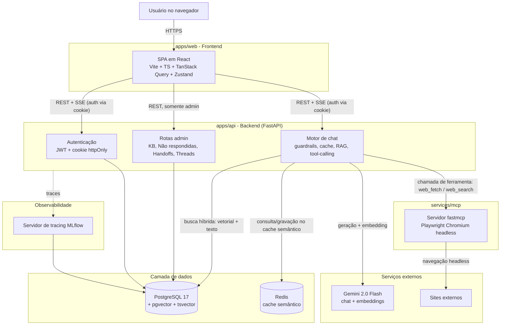
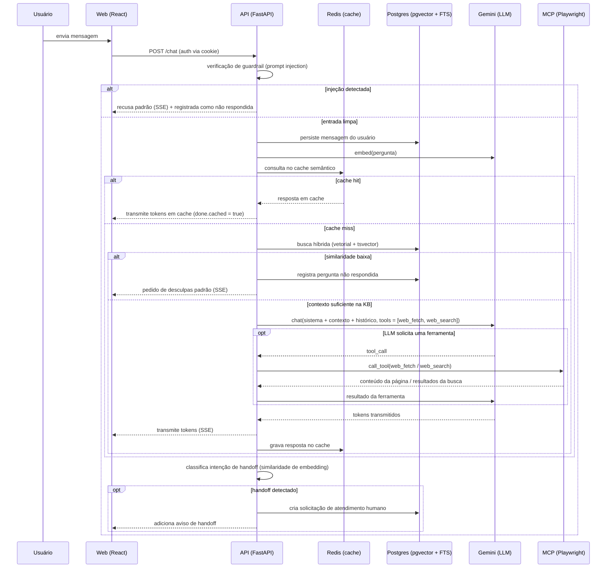
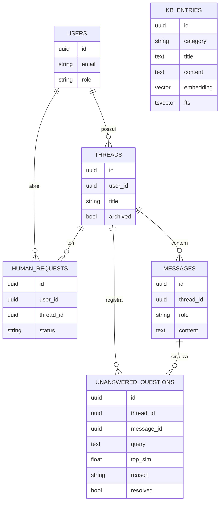

# Agente de Suporte com IA para a Mission

Uma aplicação web com um agente de suporte com IA para a Mission, com um dashboard administrativo para gerenciar a base de conhecimento.

## Stack

| Camada | Tecnologia |
|---|---|
| Backend | Python 3.14, FastAPI, SQLAlchemy 2 (async), asyncpg, Alembic |
| Banco de dados | PostgreSQL 17 + pgvector (RAG) |
| Frontend | React 19, Vite, TypeScript, TanStack Query, Zustand, Tailwind v4 |
| Autenticação | cookies httpOnly + JWT (HS256) |
| LLM | Gemini 2.0 Flash (provedor substituível; SDK `google-genai` do Google) |
| MCP | servidor fastmcp + Playwright (Chromium headless) para `web_fetch` |
| Observabilidade | MLflow (servidor de tracing, com o mesmo backend Postgres) |
| Container | Docker Compose (serviços: db, api, mcp, web) |
| Ferramentas | uv (Python), bun (JS), ruff, eslint, prettier |

## Arquitetura

### Visão geral do sistema



### Fluxo de uma requisição de chat



### Modelo de dados



`KB_ENTRIES` não está vinculada a um usuário ou thread. É a base de conhecimento compartilhada que toda requisição de chat consulta por meio de busca híbrida vetorial e textual.

### Resumo da arquitetura

O sistema é dividido em quatro partes com deploy independente, conectadas via Docker Compose:

- **`apps/web`** é uma SPA em React. Ela nunca vê um token de API: a autenticação acontece inteiramente por um cookie httpOnly definido pelo backend, e a comunicação com `apps/api` acontece via REST para operações de CRUD e via SSE para as respostas do chat em streaming.
- **`apps/api`** é o serviço central em FastAPI. Ele cuida da autenticação (JWT em cookie httpOnly), do pipeline de chat (guardrails, depois cache semântico, depois busca híbrida via RAG, depois a chamada ao LLM com tool-calling, depois a classificação de handoff) e das rotas administrativas de CRUD (KB, perguntas não respondidas, handoffs, threads), todas usando o mesmo banco Postgres.
- **`services/mcp`** é um servidor fastmcp separado, responsável por um navegador Playwright headless. A API nunca acessa o navegador diretamente: ela chama o servidor MCP como uma ferramenta pelo protocolo MCP, o que mantém essa superfície mais pesada e menos confiável isolada do processo principal da API.
- **Postgres + pgvector** é a fonte única de verdade tanto para os dados relacionais quanto para a busca vetorial. Um único banco, sem um vector store separado, o que mantém simples os joins entre entradas da KB, scores de similaridade e consultas administrativas. O **Redis** entra apenas como cache semântico de respostas, e não como dado de fonte de verdade.
- O **MLflow** rastreia cada etapa relevante de um turno de chat (chamadas de embedding, chamadas de ferramentas, seed da KB) usando o mesmo backend Postgres, dando uma visão por requisição do que o agente fez sem precisar de mais um datastore.

Cada uma dessas fronteiras de serviço existe por um motivo: a automação do navegador é isolada por segurança e estabilidade, o provedor de LLM é abstraído em `providers.py` para poder ser trocado, e o cache funciona como um side-car em vez de ficar embutido no caminho principal da requisição, de forma que uma falha no cache não derruba o chat.

## Estrutura do repositório

```
ai-support-agent/
├── apps/
│   ├── api/                # backend FastAPI
│   └── web/                # SPA em React
├── services/
│   └── mcp/                # servidor fastmcp (web_fetch)
├── infra/                  # Dockerfiles + docker-compose.yml
├── specs/                  # (gitignored) documentos de planejamento
└── .env.example            # todas as variáveis de ambiente
```

## Como rodar localmente

### Pré-requisitos

- Docker + Docker Compose
- Uma chave de API do Gemini

### Passos

1. Rode `cp .env.example .env` e preencha:
   - `GEMINI_API_KEY`: sua chave do Gemini
   - `JWT_SECRET`: qualquer string aleatória com 32+ bytes
   - `ADMIN_EMAIL`: o e-mail que recebe o papel de admin no primeiro login

2. `docker compose -f infra/docker-compose.yml up --build`

3. Aguarde os healthchecks passarem (cerca de 30s). Serviços:
   - Web: http://localhost:5173
   - API: http://localhost:8000
   - UI do MLflow: http://localhost:5000
   - MCP: interno (não exposto ao host)

4. Abra http://localhost:5173. Informe qualquer e-mail. O e-mail definido como admin vira admin automaticamente.

## Estratégia da base de conhecimento

A base de conhecimento fica em uma única tabela do Postgres, `kb_entries`, com uma linha para cada informação (`category`, `title`, `content`). Cada linha é indexada de duas formas, para que a busca não dependa de o usuário perguntar exatamente com as mesmas palavras usadas ao cadastrar a informação:

- **Busca semântica (vetorial)**: o `content` é transformado em embedding pelo modelo de embeddings do Gemini e armazenado em uma coluna `pgvector`, indexada com HNSW (`vector_cosine_ops`). É isso que permite ao agente relacionar uma pergunta como "quanto custa?" a uma entrada com o título "Planos e preços", mesmo sem nenhuma palavra em comum.
- **Busca lexical (full-text)**: o mesmo texto também é indexado como um `tsvector` em português (índice GIN), então termos exatos, nomes de produtos e siglas continuam sendo encontrados mesmo quando a similaridade de embedding fica no limite.

No momento da consulta, os dois scores são calculados em uma única query SQL e combinados com um peso configurável (`vector_weight`, com padrão de 0.85 a favor do semântico). Essa abordagem híbrida acaba sendo mais robusta do que qualquer um dos dois sinais isoladamente. O score combinado do melhor resultado é então comparado com `rag_unanswered_threshold`; se ficar abaixo, o agente não tenta responder e registra a pergunta em vez de arriscar uma resposta alucinada.

Novas entradas criadas pelo dashboard administrativo são embeddadas e indexadas de forma assíncrona (`BackgroundTasks` → `reembed_entry`), então a requisição de criação/edição retorna na hora, e a entrada já fica pesquisável no próximo turno de chat. Não existe uma etapa de reindexação em lote para esperar.

**Registro de perguntas não respondidas**: sempre que a confiança da busca é baixa demais, ou quando o próprio LLM responde com o marcador `[[NO_INFO]]` depois de também não encontrar a resposta via busca na web pelo MCP, a pergunta é gravada em `unanswered_questions` junto com o score de similaridade e um motivo (`no_context` vs `injection`), para que os admins consigam ver exatamente o que está faltando na base de conhecimento.

## Integração com MCP

O acesso à web é implementado como um **servidor MCP** independente (`services/mcp`), em vez de código de scraping embutido na API. Ele expõe duas ferramentas, `web_fetch` (busca uma URL específica) e `web_search` (faz uma pesquisa na web), usando uma instância headless do Playwright/Chromium por baixo.

A API se conecta a ele como um cliente MCP (`fastmcp.Client`) e vincula as duas ferramentas à chamada do LLM (`llm.bind_tools([...])`), em vez de decidir por correspondência de palavras-chave se deve ou não buscar uma página. Isso significa que:

- É o **LLM quem decide** quando uma ferramenta é necessária. "Acesse o site da Mission e liste os produtos" naturalmente dispara uma chamada de `web_fetch`, e "busque notícias sobre Mission Brasil" dispara `web_search`, em vez de o backend tentar prever cada possível forma de perguntar isso.
- As chamadas de ferramenta são executadas pela API, o resultado volta para o LLM como uma `ToolMessage`, e a resposta seguinte do LLM, já embasada nesse resultado, é o que é transmitido ao usuário.
- Manter o navegador em um **processo separado** significa que uma página lenta ou que trava não consegue derrubar a API principal, e a dependência do navegador (Playwright + Chromium) não deixa a imagem do container da API mais pesada.
- Um timeout síncrono de 20s limita o pior caso de latência quando uma página trava.

## Features bônus implementadas

- **Cache de respostas (semântico)**: feito. O Redis, por meio de um índice HNSW via `RedisVectorStore`, é consultado antes de qualquer chamada ao LLM na primeira mensagem de uma thread. Um hit acima de `cache_sim_threshold` pula o LLM por completo e transmite a resposta em cache, sinalizada ao frontend via `done.cached = true`. O cache só é consultado no primeiro turno de uma thread, não no meio de uma conversa, já que os turnos seguintes dependem de um contexto de conversa que uma simples correspondência semântica não consegue capturar.
- **Atendimento humano (handoff)**: feito. A intenção do usuário de escalar para um humano ("quero falar com um atendente", "preciso de ajuda humana" e frases parecidas) é detectada transformando a mensagem do usuário em embedding e comparando-a por similaridade de cosseno com um conjunto de frases de referência (`classify_handoff`), em vez de usar correspondência de palavras-chave, que é mais frágil. Um handoff detectado cria uma linha em `human_requests` (status `open`), visível em `/admin/handoffs`, onde o suporte pode mudar o status para `contacted` ou `closed`.
- **Observabilidade do agente**: feito parcialmente. O tracing com MLflow está integrado ao backend (`@mlflow.trace` nas chamadas de embedding, de ferramentas e de seed da KB), e cada span vai para o mesmo servidor MLflow com backend em Postgres, navegável em `:5000`. O que ainda falta é uma página de KPIs dedicada em `/admin`, mostrando as métricas bônus (tokens consumidos, custo estimado por conversa, tempo médio de resposta, contagem de perguntas não respondidas/handoffs) dentro da própria aplicação, sem depender de o avaliador abrir a UI do MLflow separadamente.

## Funcionalidades obrigatórias

| # | Requisito | Status |
|---|---|---|
| 1 | Login por e-mail (sem senha, sem login social) | Feito |
| 2 | Interface de chat estilo ChatGPT (enviar, ver respostas, continuar conversa, sidebar com múltiplas threads) | Feito |
| 3 | Base de conhecimento sobre a Mission | Feito (RAG no backend; frontend renderiza as respostas em streaming) |
| 4 | Dashboard admin para gerenciar conteúdo da KB | Feito, `/admin/kb` (CRUD via drawer) |
| 5 | Registro de perguntas não respondidas | Feito, `/admin/unanswered` |
| 6 | Integração com MCP (busca externa na web) | Feito (servidor MCP no backend com Playwright; timeout síncrono de 20s) |
| 7 | Memória por usuário (threads vinculadas ao e-mail) | Feito |

## Features bônus

Status resumido (veja [Features bônus implementadas](#features-bônus-implementadas) acima para entender como cada uma funciona de fato):

| # | Bônus | Status |
|---|---|---|
| 1 | Observabilidade do agente (página de KPIs) | Parcial. Tracing com MLflow feito; página de KPIs no admin ainda pendente |
| 2 | Cache de respostas (semântico) | Feito (backend; exibição no frontend planejada) |
| 3 | Atendimento humano | Feito, `/admin/handoffs` (transições de status) |

## Admin

Depois de fazer login com o e-mail definido em `ADMIN_EMAIL`, você verá um link "Admin" na barra lateral. O dashboard administrativo tem 3 abas:

- **Base de conhecimento**: CRUD nas 5 categorias da KB (`product`, `service`, `flow`, `institutional`, `faq`).
- **Não respondidas**: perguntas que o agente não conseguiu responder (confiança baixa ou nenhuma correspondência na KB). Marque como resolvida para tirá-la da lista.
- **Handoffs**: solicitações de atendimento humano feitas pelos usuários. Marque como `contacted` ou `closed`.

Novas entradas na KB ficam pesquisáveis no próximo chat. As entradas de não respondidas e de handoffs são criadas automaticamente pelo backend.

## Notas para quem for avaliar

- O frontend lê o backend usando cookies httpOnly. Não há manipulação de token no bundle JS.
- O chat é transmitido via SSE, então o painel de rede vai mostrar uma resposta `text/event-stream` de longa duração ao enviar uma mensagem.
- O MLflow rastreia cada turno de chat. A UI de traces em `:5000` mostra a árvore completa de spans (embed, cache, RAG, LLM, MCP).
- A ferramenta `web_fetch` do MCP é acionada quando o usuário pede algo no estilo "acesse o site"; o agente detecta automaticamente palavras como "acesse", "visite", "site da mission".
- O cache semântico do backend aparece através da flag `done.cached` no evento SSE, e a chamada ao LLM é pulada quando há um cache hit.